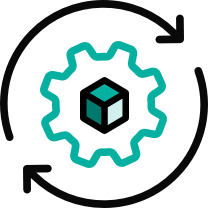

# kpack

Kubernetes Native Container Build Service

kpack extends [Kubernetes](https://kubernetes.io/docs/concepts/extend-kubernetes/api-extension/custom-resources/) and utilizes unprivileged kubernetes primitives to provide builds of OCI images as a platform implementation of [Cloud Native Buildpacks](https://buildpacks.io) (CNB).

kpack provides a declarative builder resource that configures a Cloud Native Buildpacks build configuration with the desired buildpack order and operating system stack.

kpack provides a declarative image resource that builds an OCI image and schedules rebuilds on source changes and from builder buildpack and builder stack updates.

kpack also provides a build type to execute a single Cloud Native Buildpack OCI image build.

### Documentation & Getting Started

- [Install kpack](docs/install.md)
- Get started with [the tutorial](docs/tutorial.md) 
- Check out the documentation on kpack concepts:
    - [Stacks](docs/stack.md)
    - [Stores](docs/store.md)
    - [Images](docs/image.md)
    - [Secrets](docs/secrets.md)
    - [Builders](docs/builders.md)
    - [Builds](docs/build.md)
    - [Service Bindings](docs/legacy-cnb-servicebindings.md)

- Interact with kpack using [kpack CLI](https://github.com/vmware-tanzu/kpack-cli/blob/main/docs/kp.md)

- Tailing logs with the kpack [log utility](docs/logs.md)
 
- Documentation on [Local Development](docs/local.md)

### kpack Working Group

There is a weekly working group meeting to discuss all things kpack!

The meeting takes place every Tuesday at 10 AM EST.

[This doc](https://docs.google.com/document/d/1I9n5pVsuos7mJPrzr5YbSPqSXymPaRbhVtcmSGEkUMc) contains the zoom link and notes, along with the recordings of previous meetings.

Come join us in the [Kubernetes slack](https://kubernetes.slack.com/channels/kpack) as well!
