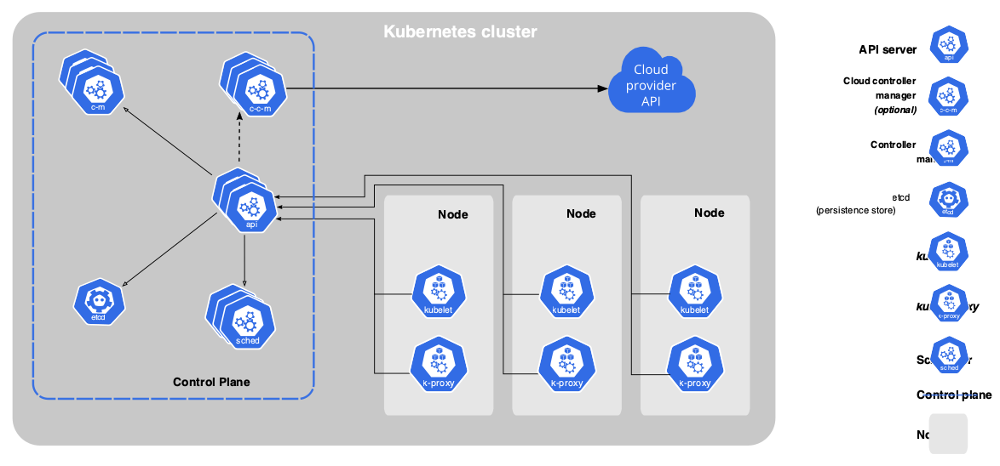
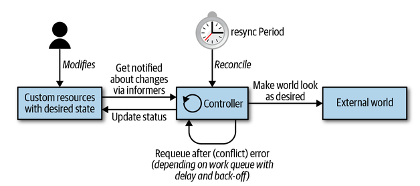
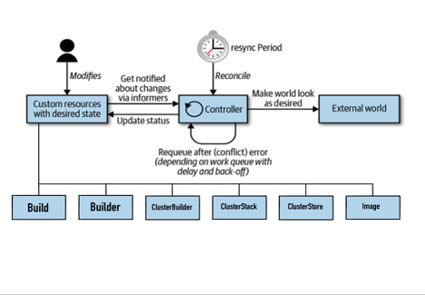
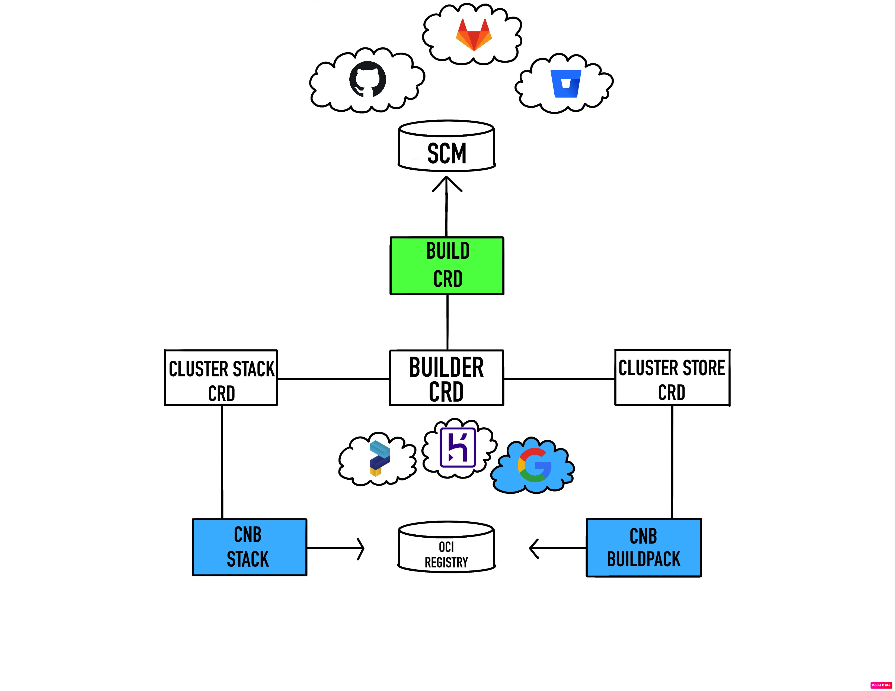

## Kubernetes Overview

[Kubernetes](https://kubernetes.io) is a portable, extensible, open-source platform for managing containerized workloads and services. [Kubernetes](https://kubernetes.io) is the standard platform to run those applications. It provides a framework to run distributed systems resiliently, takes care of scaling and failover of  workloads, and offers capabilities like:
- Service discovery
- Storage orchestration
- Automated rollouts and rollbacks
- Self-healing
- Secret and configuration management

The following diagram (from kubernetes [documentation](https://kubernetes.io/docs/concepts/overview/components/)) shows the main components of [Kubernetes](https://kubernetes.io):



The core of [Kubernetes](https://kubernetes.io)’ control plane is the API server; it exposes an HTTP API that lets end users, different parts of the cluster, and external components communicate with one another. For example, the kubelet is an agent that runs on each cluster’s node and communicates with the control plane through the API server.

### How it works

According to the [Kubernetes](https://kubernetes.io) [glossary](https://kubernetes.io/docs/reference/glossary/?fundamental=true#term-controller), controllers implement a control loop, watching the shared state of the cluster through the API server and making changes in an attempt to move the current state toward the desired state.
Using some pseudo-code we can define the control loop as follows:

```
while(true) {
  // Step 1
  read_resource_state()

  // Step 2
  change_the_world()

  // Step 3
  update_resource_state()
}
```

The control loop is depicted in the image below; it shows the typical moving parts, with the main loop of the controller in the middle. This main loop is continuously running inside of the controller process. This process is usually running inside a pod in the cluster.



The controller typically uses the following data structures to do its job of making the world look like the desired state:
- Informers, which watch the desired state of the resources and implement a resync mechanism that enforces periodic reconciliation.
- Work queues, which are components used by the event handler to handle queuing of the state change and that help to implement retries.

Another important piece in this puzzle are the informers: they provide a high-level programming interface that reacts to changes (adds, removes, updates) of objects in the API server. When [custom resources](https://kubernetes.io/docs/concepts/extend-kubernetes/api-extension/custom-resources/) are created, the natural next step is to have “someone” watching for changes over these resources - that’s the informer’s job!

#### How does kpack fit in all this?

The [Kubernetes](https://kubernetes.io) API can be extended in different ways; one of them is using [custom resources](https://kubernetes.io/docs/concepts/extend-kubernetes/api-extension/custom-resources/) - extensions of the [Kubernetes](https://kubernetes.io) API that are not necessarily available in a default [Kubernetes](https://kubernetes.io) installation. A [custom resources](https://kubernetes.io/docs/concepts/extend-kubernetes/api-extension/custom-resources/) represents a customization of a particular [Kubernetes](https://kubernetes.io) installation.

kpack extends [Kubernetes](https://kubernetes.io) using [custom resources](https://kubernetes.io/docs/concepts/extend-kubernetes/api-extension/custom-resources/) and utilizes unprivileged [Kubernetes](https://kubernetes.io) primitives to provide builds of OCI images as a [platform implementation](https://github.com/buildpacks/spec/blob/main/platform.md) of Cloud Native Buildpacks. This means that kpack takes the CNB-defined concepts ([builder](https://buildpacks.io/docs/concepts/components/builder/), [stacks](https://buildpacks.io/docs/concepts/components/stack/), [buildpack](https://buildpacks.io/docs/concepts/components/buildpack/)) and bakes them into the [Kubernetes](https://kubernetes.io) extension model using [custom resources](https://kubernetes.io/docs/concepts/extend-kubernetes/api-extension/custom-resources/) and exposing a [declarative API](https://kubernetes.io/docs/concepts/extend-kubernetes/api-extension/custom-resources/#declarative-apis) for interacting with it.

The [declarative API](https://kubernetes.io/docs/concepts/extend-kubernetes/api-extension/custom-resources/#declarative-apis) enforces a separation of responsibilities. Operators declare the configuration for a CNB image or define which [buildpacks](https://buildpacks.io/docs/concepts/components/buildpack/) or [stacks](https://buildpacks.io/docs/concepts/components/stack/) must be used, and kpack - using its custom controller - will take care of the heavy lifting, keeping the state of the custom objects in sync with the declared desired state.

An updated version of our previous image shows the kpack custom resources in the main control loop schema.



For each [custom resource](https://kubernetes.io/docs/concepts/extend-kubernetes/api-extension/custom-resources/), a custom controller is defined to manage each instance of the [custom resource](https://kubernetes.io/docs/concepts/extend-kubernetes/api-extension/custom-resources/) created, kpack handles any change happening to the [custom resource](https://kubernetes.io/docs/concepts/extend-kubernetes/api-extension/custom-resources/) and the logic implemented in the reconciliation loop will take care of  `change_the_world()`  and update the status of the [custom resource](https://kubernetes.io/docs/concepts/extend-kubernetes/api-extension/custom-resources/). Let’s explain this in a little more detail.


The image above shows kpack’s [custom resources](https://kubernetes.io/docs/concepts/extend-kubernetes/api-extension/custom-resources/) and their relationship, let’s imagine we are hosting our application source code in a [Source Code Management System (SCM)](https://www.atlassian.com/git/tutorials/source-code-management) and we configure an Image Custom Resource (Image CRD) in kpack that uses any of the public buildpack providers ([paketo](https://paketo.io), [heroku](https://elements.heroku.com/buildpacks) or [google](https://github.com/GoogleCloudPlatform/buildpacks)). What would happen if the underlying run-image configured in our CNB stack is updated by the buildpack provider? well, kpack will automatically try to update the state of our Image Custom Resource (Image CRD) and a new Build Custom Resource (Build CRD) will be instantiated. In the diagram below, we represent on blue a change to the buildpack or stack, these events, will fire a new build custom resource (green) associated with the image custom resource.



To summarize, kpack will monitor the inputs to the image resource to rebuild the OCI image when the underlying source or the builder's buildpacks or stacks have changed.
