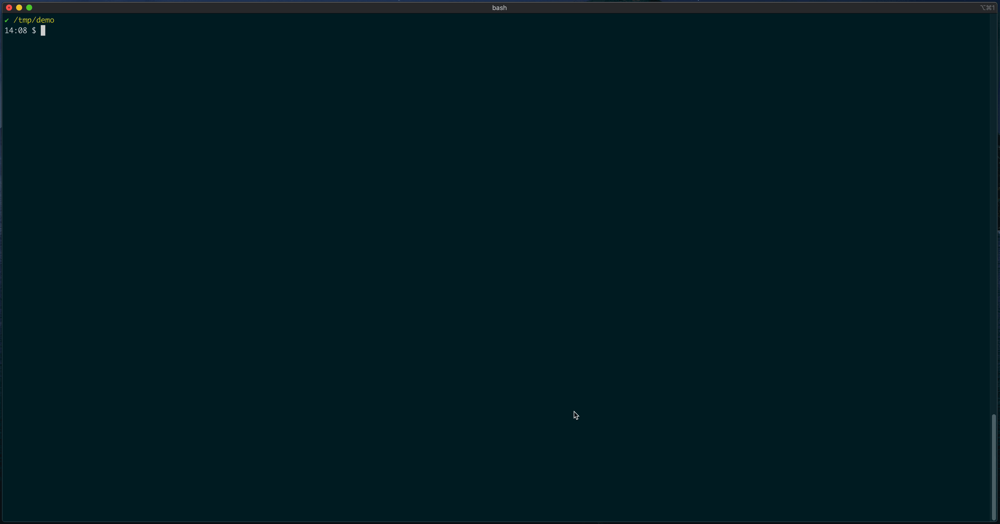

## Problem

The [kpack-cli](https://github.com/vmware-tanzu/kpack-cli) currently faciliates an automated CLI experience well. With the CLI, users can create and inspect individual k8s objects like `builders`, `clusterstores`, `images`, etc. However, an operator persona occasionally wants a bird's eye view of all these managed objects. This requirement becomes even more pronounced _while debugging_.

There's currently no way for an admin level user get this sort of information, all at once. The current recourse is to perfrom `kp <object> list` for all of the objects that you wish to inspect. Then you traverse the heirarchy to perform `kp <object> status <object-name>` . This sequence of steps is not only tedious but amenable to oversight.

Lastly, the `kp` CLI occasionally comes up short when it comes to debugging kpack objects. Users frequently feel the need to resort to the `kubectl` command to perform a deeper inspection. Although this RFC does not directly address this problem, it steps in that direction. A large chunk of debugging often comes down to finding out what has most recently changed (in fact [RFC #522](https://github.com/pivotal/kpack/pull/522) addresses this quite well). Having a dashboard that can give you a bird's eye view of all objects, while highlighting new updates, can provide pointers towards what to drill into.

**Concrete Use Cases**

1. A kpack operator upgrades his java `buildpack` to patch a CVE, which updates his `clusterstore`, which updates his `builder`. And now he would like to see that a new `build` has been triggered for _every image_ built by this java-buildpack.

1. A customer engineer is brought onto a customer call. She is informed that rebase builds are not taking for a newly updated `clusterstack`. She would like to know if this behavior is happening across the board or only among select `images`. She also wants to verify that the clusterstack is configured with an active builder. She will not be familiar with any naming conventions that the customer's engineers are using.

## Outcome

1. The outcome is the kpack operator rarely feels the need to rely on companion CLIs (`pack`, `kubectl`) to manage their kpack workloads.

1. An eventual outcome is that the `kp` tool becomes fully sufficient for debugging kpack.

## Actions to take

All implementation code would likely reside in the [kpack-cli](https://github.com/vmware-tanzu/kpack-cli) repository. The step to take would be to implement a `kp dashboard` command that launches a full-screen variant of the terminal interaction shown in the mockup above.

## Complexity

Medium.

Introducing the dashboard itself into the CLI isn't more than medium complexity. Additional complexity lies in how much functionality that the dashboard will be capable of. Though this complexity can be mitigated by moving iteratively, and by playing new functionality by ear.

## Prior Art

**Projects**

Highly interative terminal UIs have been done by projects in our domain before, notably: [dive](https://github.com/wagoodman/dive) and [k9s](https://github.com/derailed/k9s). Code for the mockup above can be found in this [./main.go](https://gist.github.com/aemengo/f8522be566ea43e44d6dae1eff6d0111).

**Issues**

The [problem](#problem) stated above has been echoed in previous Github Issues. Like [vmware-tanzu/kpack-cli#83](https://github.com/vmware-tanzu/kpack-cli/issues/83#issue-710376508).

## Alternatives

* Continue to bolster existing `kp <object> status` commands to show more information conducive to managing or debugging kpack workloads.
* Leave this functionality out of `kp`; addressing the [problem](#problem) statement in other tooling or products.
* Leave this functionality out of `kp`; expecting users to defer to other CLIs when needed.

## Risks

1. A risk lies in introducing disharmony into the user experience of the kpack-cli. An end user might wonder: "Are there are multiple ways to do the same thing? What is the best way to do X?".

1. A risk lies in reducing user incentive to pursue other kpack products that solve for overlapping use-cases (i.e. a web-based application).
